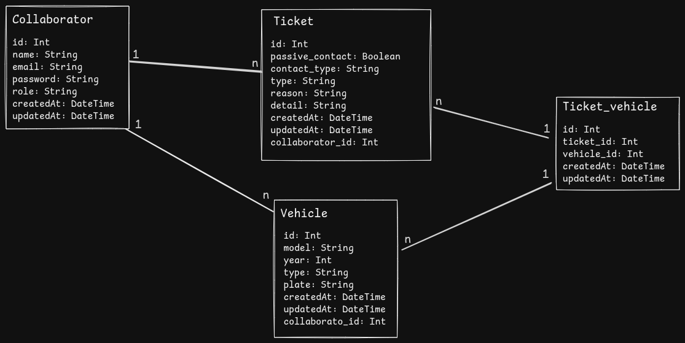

### [Desafio](https://github.com/comigotech/avaliacao-candidatos-fullstack)


# BACK-END
### Requisitos para executar o projeto
- Node v20
- Docker V27 (Docker nesta versão já vem com o utilitário `docker compose`) cuidado ao tentar rodar o projeto com o `docker-compose` comando similar porém binário diferente.

### Como executar o projeto

- Entre na pasta `back-end`
- Deixei o `.env` exposto no repositório para faciltar a configuração, Então não é preciso fazer nenhuma configuração de variável.
- Use o comando ``npm run database:up`` para subir o banco de dados postgres
- O comando ``npm run database:up`` utiliza `docker compose`, caso utilize o `docker-compose` use o comando `docker-compose up --build`
- Para executar o projeto é necessário o comando `npm i` para instalar as dependências.
- Após instalar as dependências, execute o projeto com `npm run dev`, aparecerá um log localhost com a porta que foi definida na variável `PORT` no .env ou na porta 3001 como padrão.

### logins
- Quando inicializar o projeto, será executado um script juntamente com servidor para criar dois usuários, são eles:   
```typescript
const users = [
  {
    name: 'Atendente',
    email: 'atendente@email.com',
    password: 'comigo123',
    role: 'atendente'
  },
  {
    name: 'Administrador',
    email: 'admin@email.com',
    password: 'comigo123',
    role: 'admin'
  }
];
```
 
### Modelo entidade relacionamento

 

### TODO
- [x] 1. Nível 1 - Validação
- [x] 2. Nível 2 - Persistência
- [x] 3. Nível 3 - Autenticação
- [x] 4. Nível 4 - Gerenciamento de permissões
- [x] 5. Nível 5 - Testes unitários
- [x] 6. Nível 6 - Infra
- [ ] 7. Nível 7 - Cloud
- [ ] 8. Nível 8 - Monitoramento e Observabilidade


#### Operações

- [x] 1. Create
- [x] 2. Read
- [x] 3. Update
- [x] 4. Delete
- [ ] 5. Filter


# Front-end

## Requisitos para executar o projeto

- NODE V20

## Como iniciar o projeto

- Entre na pasta front-end
- Baixe as dependências: `npm i`
- Inicialize o projeto:` npm run dev`

### TODO
- [x] 1. Nível 1 - Cadastro
- [x] 2. Nível 2 - Conectando na API
- [x] 3. Nível 3 - Listando
- [x] 4. Nível 4 - Autenticação
- [ ] 5. Nível 5 - Testes 

### Funcionalidades

- [x] Manter Conexão
- [x] Autenticação
- [x] Permissões